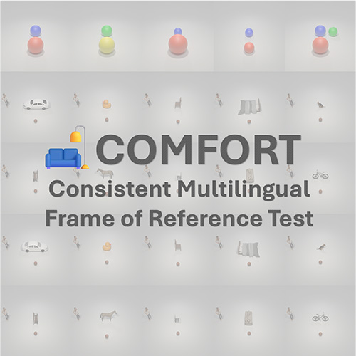

# 🛋️ Do Vision-Language Models Represent Space and How? Evaluating Spatial Frame of Reference Under Ambiguities

This repository provides the code and instructions for using the evaluation protocol to systematically assess the spatial reasoning capabilities of VLMs, <ins>CO</ins>nsistent <ins>M</ins>ultilingual <ins>F</ins>rame <ins>O</ins>f <ins>R</ins>eference <ins>T</ins>est (COMFORT). Follow the steps below to set up the environment, generate data (optional), and run experiments. Feel free to create an issue if you encounter any problems. We also welcome pull requests.

## Coming Soon